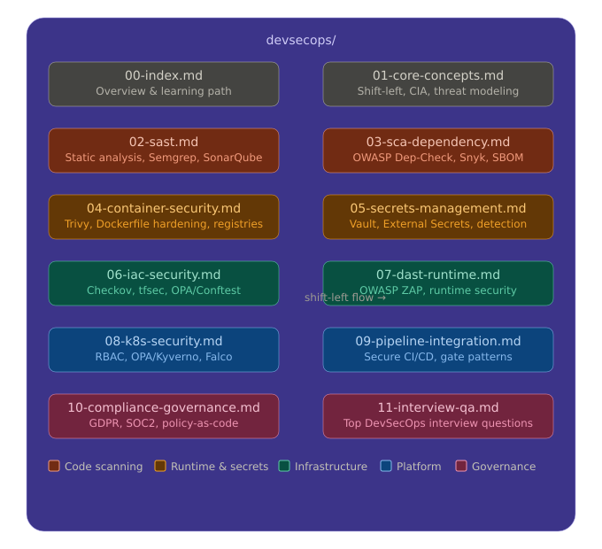

# DevSecOps — Index & Learning Path

## What Is DevSecOps?

DevSecOps integrates security practices into every stage of the software development lifecycle (SDLC) rather than treating security as a final gate before release. The core idea is **shift-left** — move security checks earlier in the pipeline so issues are caught when they are cheapest to fix.

```
Traditional:  Dev → Dev → Dev → QA → Security → Ops  (security is a bottleneck)
DevSecOps:    Dev+Sec → Dev+Sec → Dev+Sec → QA+Sec → Ops+Sec  (security is embedded)
```

## Why It Matters for Interviews

DevSecOps is one of the fastest-growing specialisations in the DevOps/Cloud space. Companies ask about it because:
- Cloud-native architectures have large attack surfaces (containers, APIs, IAM)
- Compliance requirements (GDPR, SOC2, ISO27001) require demonstrable security controls
- Supply-chain attacks (Log4Shell, SolarWinds) made dependency security critical
- Kubernetes clusters are frequently misconfigured and exploited

## Folder Structure



| File | Topic | Key Tools |
|------|-------|-----------|
| `01-core-concepts.md` | Shift-left, threat modeling, OWASP, CIA | STRIDE, OWASP Top 10 |
| `02-sast.md` | Static code analysis | Semgrep, SonarQube, Bandit |
| `03-sca-dependency.md` | Dependency & supply-chain security | Snyk, OWASP Dep-Check, SBOM |
| `04-container-security.md` | Image scanning, hardening | Trivy, Grype, Docker Bench |
| `05-secrets-management.md` | Secrets handling, detection, rotation | HashiCorp Vault, ESO, git-secrets |
| `06-iac-security.md` | Terraform/Helm/K8s manifest scanning | Checkov, tfsec, OPA, Conftest |
| `07-dast-runtime.md` | Dynamic testing, runtime defence | OWASP ZAP, Falco, eBPF |
| `08-k8s-security.md` | Kubernetes-specific hardening | RBAC, Kyverno, OPA Gatekeeper |
| `09-pipeline-integration.md` | Building a secure CI/CD pipeline | GitLab, Jenkins, GitHub Actions gates |
| `10-compliance-governance.md` | GDPR, SOC2, policy-as-code | Open Policy Agent, audit logging |
| `11-interview-qa.md` | Interview questions & answers | — |

## The DevSecOps Pipeline (Mental Model)

```
┌──────────┐   ┌──────────┐   ┌──────────┐   ┌──────────┐   ┌──────────┐
│  CODE    │   │  BUILD   │   │   TEST   │   │ RELEASE  │   │ OPERATE  │
│          │   │          │   │          │   │          │   │          │
│ • SAST   │→  │ • SCA    │→  │ • DAST   │→  │ • Sign   │→  │ • Falco  │
│ • Secrets│   │ • Image  │   │ • IAST   │   │ • Policy │   │ • Audit  │
│   detect │   │   scan   │   │   scan   │   │   gates  │   │ • SIEM   │
│ • IaC    │   │ • SBOM   │   │          │   │          │   │          │
│   lint   │   │   gen    │   │          │   │          │   │          │
└──────────┘   └──────────┘   └──────────┘   └──────────┘   └──────────┘
```

## Recommended Learning Order

1. **Start with core concepts** — understand the threat landscape and OWASP Top 10 before tooling
2. **Secrets management** — most impactful, commonly asked in interviews, high real-world value
3. **Container security** — essential since everything runs in containers now
4. **SAST + SCA** — how to integrate scanning into a pipeline
5. **IaC security** — especially if you know Terraform already
6. **Kubernetes security** — builds on the K8s knowledge you already have
7. **Pipeline integration** — tie everything together in CI/CD
8. **DAST + runtime** — advanced, differentiator in senior interviews
9. **Compliance** — important for Germany/EU roles

## Key Concepts Quick Reference

| Concept | One-line definition |
|---------|-------------------|
| Shift-left | Move security checks earlier in the SDLC |
| SAST | Scan source code without executing it |
| DAST | Test a running application from the outside |
| SCA | Scan third-party dependencies for CVEs |
| SBOM | Software Bill of Materials — inventory of all components |
| CVE | Common Vulnerabilities and Exposures — public vuln database |
| CVSS | Severity score for vulnerabilities (0–10) |
| Least privilege | Grant only the minimum permissions needed |
| Zero trust | Never trust, always verify — even internal traffic |
| Policy-as-code | Security rules defined in code, enforced automatically |

## Relevance for Germany / EU Roles

- **GDPR** — data residency, PII handling, right to erasure affect architecture decisions
- **BSI (Bundesamt für Sicherheit in der Informationstechnik)** — German federal cybersecurity agency, sets standards many companies follow
- **NIS2 Directive** — EU-wide cybersecurity regulation that came into effect 2024, affects critical infrastructure
- **ISO 27001** — common compliance requirement in German enterprise, especially automotive, finance, healthcare
